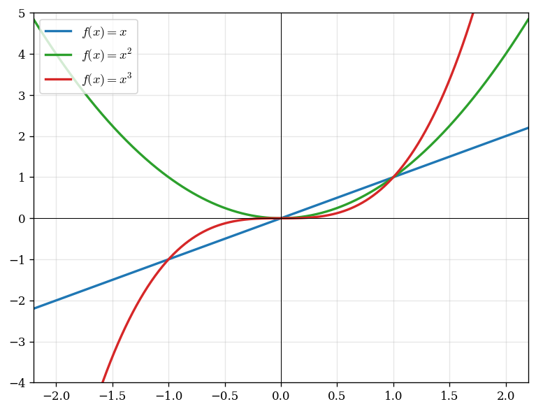
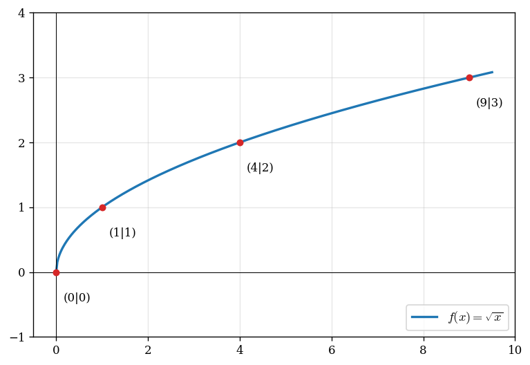
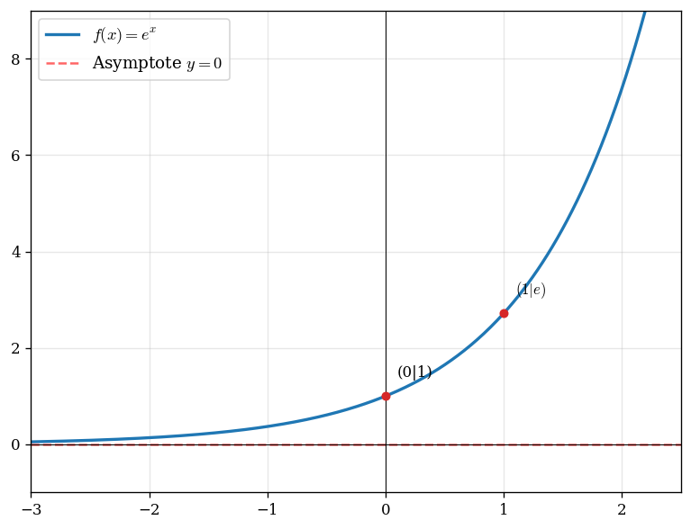
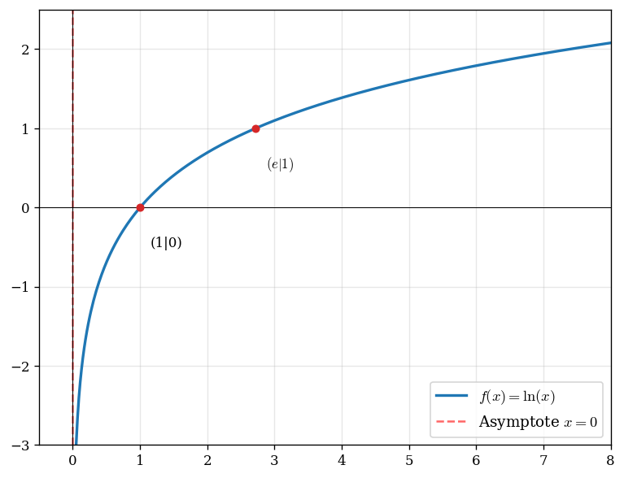
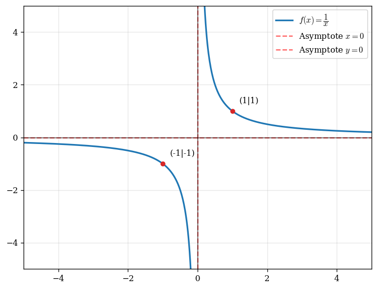
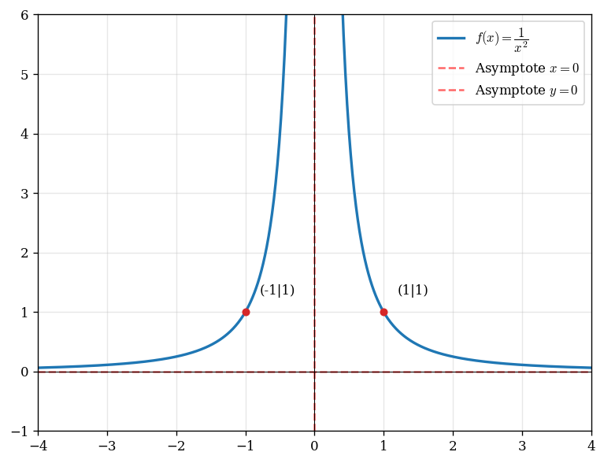
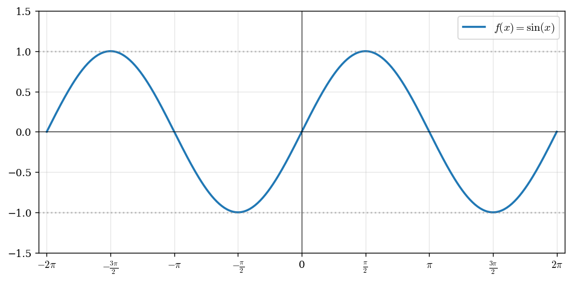
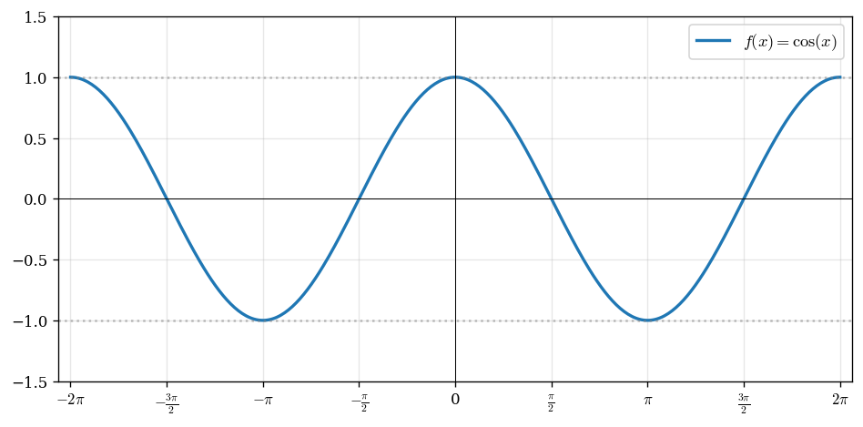
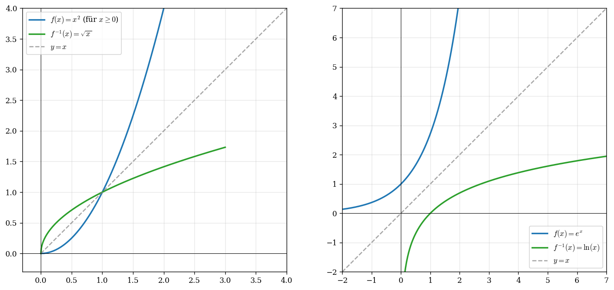

# Cheatsheet: Grundfunktionen

Schnellnachschlagewerk für die Standardtypen: Skizze, Definitions- und
Wertebereich, Symmetrie, Ableitung, Stammfunktion, Limes, Umkehrfunktion,
wichtige Werte. Für die Theorie dahinter →
[Cheatsheet Analysis](cheatsheet_analysis.md).

> Notation in den Tabellen: $\mathbb{D}$ = Definitionsbereich, $\mathbb{W}$ =
> Wertebereich, $f^{-1}$ = Umkehrfunktion. Eckige Klammern $[\,]$ = Wert wird
> angenommen, runde Klammern $]\,[$ = nur Grenzwert.

---

## 1. Polynome (ganzrationale Funktionen)

Polynome sind Funktionen der Form $f(x) = a_n x^n + \ldots + a_1 x + a_0$.
Wichtigste Vertreter: linear, quadratisch, kubisch.

| | $f(x) = mx + b$ (linear) | $f(x) = x^2$ (Parabel) | $f(x) = x^3$ (kubisch) |
|---|---|---|---|
| $\mathbb{D}$ | $\mathbb{R}$ | $\mathbb{R}$ | $\mathbb{R}$ |
| $\mathbb{W}$ | $\mathbb{R}$ (für $m \neq 0$) | $[0;\infty[$ | $\mathbb{R}$ |
| Symmetrie | — | achsensymmetrisch zur $y$-Achse | punktsymmetrisch zum Ursprung |
| Monotonie | streng monoton (Vorzeichen von $m$) | fällt für $x<0$, steigt für $x>0$ | streng monoton steigend |
| Besonderer Punkt | $(0 \mid b)$ | Tiefpunkt $(0\mid 0)$ | Sattelpunkt $(0\mid 0)$ |
| $f'(x)$ | $m$ | $2x$ | $3x^2$ |
| $F(x)$ | $\frac{m}{2}x^2 + bx$ | $\frac{x^3}{3}$ | $\frac{x^4}{4}$ |
| $\displaystyle\lim_{x\to+\infty}$ | $\pm\infty$ (je nach $m$) | $+\infty$ | $+\infty$ |
| $\displaystyle\lim_{x\to-\infty}$ | $\mp\infty$ | $+\infty$ | $-\infty$ |
| $f^{-1}$ | $\frac{x-b}{m}$ | $\sqrt{x}$ (nur für $x \geq 0$!) | $\sqrt[3]{x}$ |

**Wichtige Werte:**
$x^2$: $f(0)=0$, $f(1)=1$, $f(2)=4$, $f(3)=9$, $f(-2)=4$
$x^3$: $f(0)=0$, $f(1)=1$, $f(2)=8$, $f(-1)=-1$, $f(-2)=-8$

> $x^2$ ist auf ganz $\mathbb{R}$ **nicht** umkehrbar (nicht monoton). Erst auf
> $[0;\infty[$ einschränken, dann ist $f^{-1} = \sqrt{x}$.

→ [Rezept 13: Umkehrfunktion](rezepte/13_umkehrfunktion.md)

---

## 2. Wurzelfunktion $\sqrt{x}$

| Eigenschaft | Wert |
|---|---|
| $f(x)$ | $\sqrt{x} = x^{1/2}$ |
| $\mathbb{D}$ | $[0;\infty[$ — **nur $x \geq 0$!** |
| $\mathbb{W}$ | $[0;\infty[$ |
| Symmetrie | keine (nur halbe Funktion) |
| Monotonie | streng monoton steigend |
| $f'(x)$ | $\dfrac{1}{2\sqrt{x}}$ — bei $x = 0$ **nicht differenzierbar** (senkrechte Tangente) |
| $F(x)$ | $\dfrac{2}{3}x^{3/2} = \dfrac{2}{3}x\sqrt{x}$ |
| $\displaystyle\lim_{x\to+\infty}$ | $+\infty$ (langsam — langsamer als jedes Polynom) |
| $f^{-1}$ | $x^2$ (mit $x \geq 0$) |

**Wichtige Werte:** $\sqrt{0}=0$, $\sqrt{1}=1$, $\sqrt{4}=2$, $\sqrt{9}=3$,
$\sqrt{16}=4$, $\sqrt{25}=5$.

> Klassische Falle bei der Kettenregel: $\sqrt{u(x)}$ ableiten gibt
> $\dfrac{u'(x)}{2\sqrt{u(x)}}$ — innere Ableitung nicht vergessen!

---

## 3. Exponentialfunktion $e^x$

| Eigenschaft | Wert |
|---|---|
| $f(x)$ | $e^x$ mit $e \approx 2{,}718$ |
| $\mathbb{D}$ | $\mathbb{R}$ |
| $\mathbb{W}$ | $\,]0;\infty[\,$ — **nie $0$, nie negativ!** |
| Symmetrie | keine |
| Monotonie | streng monoton steigend |
| $f'(x)$ | $e^x$ — leitet sich selbst ab |
| $F(x)$ | $e^x$ |
| $\displaystyle\lim_{x\to+\infty}$ | $+\infty$ |
| $\displaystyle\lim_{x\to-\infty}$ | $0$ — waagrechte Asymptote $y=0$ |
| $f^{-1}$ | $\ln(x)$ |

**Wichtige Werte:** $e^0 = 1$, $e^1 = e \approx 2{,}718$, $e^2 \approx 7{,}39$,
$e^{-1} = \frac{1}{e} \approx 0{,}368$.

**Wachstumshierarchie:** $e^x \gg x^n \gg \ln(x)$ — $e^x$ gewinnt gegen jedes
Polynom für $x \to \infty$.

> Falle bei der Kettenregel: $(e^{ax})' = a \cdot e^{ax}$ — den Faktor $a$
> nicht vergessen! Beispiel: $(e^{2x})' = 2e^{2x}$.

---

## 4. Natürlicher Logarithmus $\ln(x)$

| Eigenschaft | Wert |
|---|---|
| $f(x)$ | $\ln(x)$ |
| $\mathbb{D}$ | $\,]0;\infty[\,$ — **nur $x > 0$!** |
| $\mathbb{W}$ | $\mathbb{R}$ |
| Symmetrie | keine |
| Monotonie | streng monoton steigend |
| $f'(x)$ | $\dfrac{1}{x}$ |
| $F(x)$ | $x \ln(x) - x$ (Produktregel rückwärts) |
| $\displaystyle\lim_{x\to+\infty}$ | $+\infty$ (langsam) |
| $\displaystyle\lim_{x\to 0^+}$ | $-\infty$ — senkrechte Asymptote $x = 0$ |
| $f^{-1}$ | $e^x$ |

**Wichtige Werte:** $\ln(1) = 0$, $\ln(e) = 1$, $\ln(e^2) = 2$,
$\ln\!\left(\frac{1}{e}\right) = -1$.

**Rechenregeln:**
- $\ln(a \cdot b) = \ln(a) + \ln(b)$
- $\ln\!\left(\dfrac{a}{b}\right) = \ln(a) - \ln(b)$
- $\ln(a^n) = n \cdot \ln(a)$
- $\ln(e^x) = x$ und $e^{\ln(x)} = x$

> Falle: $\ln(x_1 + x_2) \neq \ln(x_1) + \ln(x_2)$. Die Regel gilt nur für
> **Produkte**, nicht für Summen!

---

## 5. Hyperbel $\dfrac{1}{x}$

| Eigenschaft | Wert |
|---|---|
| $f(x)$ | $\dfrac{1}{x} = x^{-1}$ |
| $\mathbb{D}$ | $\mathbb{R}\setminus\{0\}$ |
| $\mathbb{W}$ | $\mathbb{R}\setminus\{0\}$ |
| Symmetrie | punktsymmetrisch zum Ursprung |
| Monotonie | streng monoton fallend (auf jedem Ast einzeln) |
| $f'(x)$ | $-\dfrac{1}{x^2}$ |
| $F(x)$ | $\ln\lvert x \rvert$ |
| Polstelle | $x = 0$ — senkrechte Asymptote |
| $\displaystyle\lim_{x\to\pm\infty}$ | $0$ — waagrechte Asymptote $y = 0$ |
| $\displaystyle\lim_{x\to 0^+}$ / $\displaystyle\lim_{x\to 0^-}$ | $+\infty$ / $-\infty$ |
| $f^{-1}$ | $\dfrac{1}{x}$ — **die eigene Umkehrfunktion** |

**Wichtige Werte:** $f(1) = 1$, $f(2) = 0{,}5$, $f\!\left(\frac{1}{2}\right) = 2$,
$f(-1) = -1$, $f(10) = 0{,}1$.

→ [Rezept 12: Gebrochen-rationale Funktionen](rezepte/12_gebrochen_rational.md)

---

## 6. Quadratischer Kehrwert $\dfrac{1}{x^2}$

| Eigenschaft | Wert |
|---|---|
| $f(x)$ | $\dfrac{1}{x^2} = x^{-2}$ |
| $\mathbb{D}$ | $\mathbb{R}\setminus\{0\}$ |
| $\mathbb{W}$ | $\,]0;\infty[\,$ — **immer positiv!** |
| Symmetrie | achsensymmetrisch zur $y$-Achse |
| Monotonie | steigt für $x<0$, fällt für $x>0$ |
| $f'(x)$ | $-\dfrac{2}{x^3}$ |
| $F(x)$ | $-\dfrac{1}{x}$ |
| Polstelle | $x = 0$ — beide Seiten gehen nach $+\infty$ |
| $\displaystyle\lim_{x\to\pm\infty}$ | $0$ — waagrechte Asymptote $y = 0$ |

**Wichtige Werte:** $f(1) = 1$, $f(2) = 0{,}25$, $f(-1) = 1$, $f\!\left(\frac{1}{2}\right) = 4$.

> Auf ganz $\mathbb{D}$ **nicht** monoton (fällt rechts, steigt links) → keine
> globale Umkehrfunktion. Erst auf $]0;\infty[$ einschränken, dann ist
> $f^{-1} = \dfrac{1}{\sqrt{x}}$.

---

## 7. Sinus $\sin(x)$

| Eigenschaft | Wert |
|---|---|
| $f(x)$ | $\sin(x)$ |
| $\mathbb{D}$ | $\mathbb{R}$ |
| $\mathbb{W}$ | $[-1; 1]$ |
| Symmetrie | punktsymmetrisch zum Ursprung |
| Periode | $2\pi$ |
| $f'(x)$ | $\cos(x)$ |
| $F(x)$ | $-\cos(x)$ |
| $\displaystyle\lim_{x\to\pm\infty}$ | **existiert nicht** (oszilliert) |
| Nullstellen | $x = k\pi$ mit $k \in \mathbb{Z}$ |
| Hochpunkte | $x = \frac{\pi}{2} + 2k\pi$, Wert $1$ |
| Tiefpunkte | $x = -\frac{\pi}{2} + 2k\pi$, Wert $-1$ |

**Wichtige Werte:**

| $x$ | $0$ | $\frac{\pi}{6}$ | $\frac{\pi}{4}$ | $\frac{\pi}{3}$ | $\frac{\pi}{2}$ | $\pi$ | $\frac{3\pi}{2}$ | $2\pi$ |
|---|---|---|---|---|---|---|---|---|
| $\sin(x)$ | $0$ | $\tfrac{1}{2}$ | $\tfrac{\sqrt{2}}{2}$ | $\tfrac{\sqrt{3}}{2}$ | $1$ | $0$ | $-1$ | $0$ |

---

## 8. Kosinus $\cos(x)$

| Eigenschaft | Wert |
|---|---|
| $f(x)$ | $\cos(x)$ |
| $\mathbb{D}$ | $\mathbb{R}$ |
| $\mathbb{W}$ | $[-1; 1]$ |
| Symmetrie | achsensymmetrisch zur $y$-Achse |
| Periode | $2\pi$ |
| $f'(x)$ | $-\sin(x)$ |
| $F(x)$ | $\sin(x)$ |
| $\displaystyle\lim_{x\to\pm\infty}$ | **existiert nicht** (oszilliert) |
| Nullstellen | $x = \frac{\pi}{2} + k\pi$ mit $k \in \mathbb{Z}$ |
| Hochpunkte | $x = 2k\pi$, Wert $1$ |
| Tiefpunkte | $x = \pi + 2k\pi$, Wert $-1$ |

**Wichtige Werte:**

| $x$ | $0$ | $\frac{\pi}{6}$ | $\frac{\pi}{4}$ | $\frac{\pi}{3}$ | $\frac{\pi}{2}$ | $\pi$ | $\frac{3\pi}{2}$ | $2\pi$ |
|---|---|---|---|---|---|---|---|---|
| $\cos(x)$ | $1$ | $\tfrac{\sqrt{3}}{2}$ | $\tfrac{\sqrt{2}}{2}$ | $\tfrac{1}{2}$ | $0$ | $-1$ | $0$ | $1$ |

**Verbindung:** $\cos(x) = \sin\!\left(x + \dfrac{\pi}{2}\right)$ — Kosinus ist
um $\frac{\pi}{2}$ nach links verschobener Sinus.

> Sin/Cos sind in Bayern eA (Analysis) selten Hauptthema, tauchen aber bei
> Aufgaben wie „Tangentensteigung der Funktion $\sin(2x) + \dots$" auf. Man
> braucht die Ableitungen und die wichtigsten Werte sicher.

---

## 9. Umkehrfunktions-Pärchen

Graph von $f^{-1}$ entsteht durch **Spiegelung an $y = x$**.

| $f$ | $f^{-1}$ | Bedingung |
|---|---|---|
| $mx + b$ | $\dfrac{x-b}{m}$ | $m \neq 0$ |
| $x^2$ | $\sqrt{x}$ | $x \geq 0$ |
| $x^3$ | $\sqrt[3]{x}$ | — (überall monoton) |
| $\sqrt{x}$ | $x^2$ | $x \geq 0$ |
| $e^x$ | $\ln(x)$ | — |
| $\ln(x)$ | $e^x$ | — |
| $\dfrac{1}{x}$ | $\dfrac{1}{x}$ | $x \neq 0$ (Selbstumkehrung) |
| $\sin(x)$ | $\arcsin(x)$ | $x \in \left[-\frac{\pi}{2};\frac{\pi}{2}\right]$ einschränken |
| $\cos(x)$ | $\arccos(x)$ | $x \in [0;\pi]$ einschränken |

**Beim Bestimmen immer angeben:** $\mathbb{D}_{f^{-1}} = \mathbb{W}_f$ und
$\mathbb{W}_{f^{-1}} = \mathbb{D}_f$.

→ [Rezept 13: Umkehrfunktion](rezepte/13_umkehrfunktion.md)

---

## 10. Übersichtstabelle (alles auf einen Blick)

| Funktion | $\mathbb{D}$ | $\mathbb{W}$ | $f'(x)$ | $F(x)$ | Asymptote / Pol |
|---|---|---|---|---|---|
| $x^n$ | $\mathbb{R}$ | siehe Polynome | $nx^{n-1}$ | $\dfrac{x^{n+1}}{n+1}$ | — |
| $\sqrt{x}$ | $[0;\infty[$ | $[0;\infty[$ | $\dfrac{1}{2\sqrt{x}}$ | $\dfrac{2}{3}x^{3/2}$ | — |
| $e^x$ | $\mathbb{R}$ | $\,]0;\infty[\,$ | $e^x$ | $e^x$ | $y = 0$ für $x \to -\infty$ |
| $\ln(x)$ | $\,]0;\infty[\,$ | $\mathbb{R}$ | $\dfrac{1}{x}$ | $x\ln(x) - x$ | $x = 0$ (für $x \to 0^+$) |
| $\dfrac{1}{x}$ | $\mathbb{R}\setminus\{0\}$ | $\mathbb{R}\setminus\{0\}$ | $-\dfrac{1}{x^2}$ | $\ln\lvert x \rvert$ | $x=0$, $y=0$ |
| $\dfrac{1}{x^2}$ | $\mathbb{R}\setminus\{0\}$ | $\,]0;\infty[\,$ | $-\dfrac{2}{x^3}$ | $-\dfrac{1}{x}$ | $x=0$, $y=0$ |
| $\sin(x)$ | $\mathbb{R}$ | $[-1;1]$ | $\cos(x)$ | $-\cos(x)$ | — (oszilliert) |
| $\cos(x)$ | $\mathbb{R}$ | $[-1;1]$ | $-\sin(x)$ | $\sin(x)$ | — (oszilliert) |

---

## Häufige Fallen

1. **$e^x$ wird nie $0$** — Wertebereich ist $]0;\infty[$, nicht $[0;\infty[$.
2. **$\ln$ braucht positives Argument** — $\ln(0)$ und $\ln(-3)$ existieren nicht.
3. **$\sqrt{x}$** ist bei $x = 0$ nicht differenzierbar (senkrechte Tangente).
4. **$x^2$ ist nicht umkehrbar auf $\mathbb{R}$** — nur auf $[0;\infty[$.
5. **$\dfrac{1}{x^2}$ ist immer positiv**, auch links — nicht mit $\dfrac{1}{x}$ verwechseln.
6. **$\ln$-Regeln gelten nur für Produkte**, nie für Summen: $\ln(a+b) \neq \ln(a) + \ln(b)$.
7. **Innere Ableitung** bei $e^{ax}$ und $\sqrt{u(x)}$ nicht vergessen.
8. **Sin/Cos haben keinen Limes für $x \to \pm\infty$** — sie oszillieren ewig.

## Siehe auch
- [Cheatsheet Analysis](cheatsheet_analysis.md) — die volle Theorie
- [Rezept 05: Verkettung & Definitionsbereich](rezepte/05_verkettung_definitionsbereich.md)
- [Rezept 09: Grenzwerte](rezepte/09_grenzwerte.md)
- [Rezept 12: Gebrochen-rationale Funktionen](rezepte/12_gebrochen_rational.md)
- [Rezept 13: Umkehrfunktion](rezepte/13_umkehrfunktion.md)
- [Rezept 18: Wertebereich bestimmen](rezepte/18_wertebereich.md)
