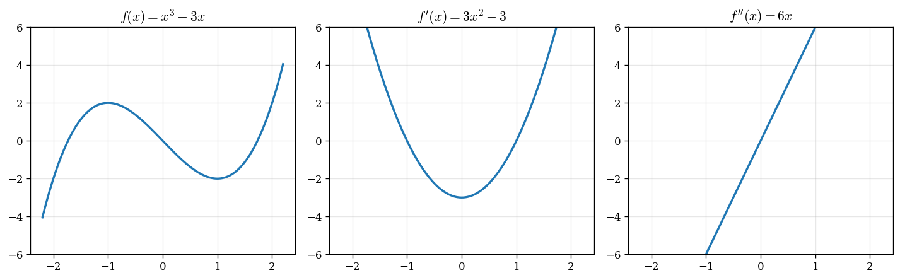

# Rezept: Graphen zuordnen ($f \leftrightarrow f' \leftrightarrow f'' \leftrightarrow F$)

> Aus dem Graphen einer Funktion (oder ihrer Ableitung/Stammfunktion) auf die übrigen schließen — z.B. erkennen, welcher Graph $f$ und welcher $f'$ ist.

## Typische Aufgabenstellung
> „Ordnen Sie die Graphen den Funktionen $f$, $f'$ und $F$ zu."
> „Der Graph zeigt $f'(x)$. Bestimmen Sie, wo $f$ Extrema/Wendepunkte hat."

## Kernregel: Eine Stufe hoch = Steigung, eine Stufe runter = Fläche

| Wenn du siehst … | … dann gilt für die Funktion DARÜBER |
|---|---|
| Graph schneidet $x$-Achse (Nullstelle) | Besonderer Punkt eine Stufe höher: Extremum oder Wendepunktkandidat (je nach Stufe) |
| Graph ist positiv (über $x$-Achse) | Funktion darüber steigt |
| Graph ist negativ (unter $x$-Achse) | Funktion darüber fällt |
| Graph hat Maximum/Minimum | Funktion darüber hat Wendepunkt |

## Schritt-für-Schritt: Aus $f'$ → Eigenschaften von $f$

1. **$f' = 0$** → Kandidat für Extremstelle von $f$
2. **$f'$ wechselt $+ \to -$** → $f$ hat lokales Maximum
3. **$f'$ wechselt $- \to +$** → $f$ hat lokales Minimum
4. **$f' > 0$** → $f$ steigt monoton
5. **$f' < 0$** → $f$ fällt monoton
6. **$f'$ hat Extremum** → $f$ hat dort oft einen Wendepunkt; sicher ist das bei Krümmungswechsel bzw. Vorzeichenwechsel von $f''$

## Schritt-für-Schritt: Aus $f''$ → Eigenschaften von $f$

1. **$f'' > 0$** → $f$ ist linksgekrümmt (Mulde, „Smiley")
2. **$f'' < 0$** → $f$ ist rechtsgekrümmt (Berg, „Frowny")
3. **$f'' = 0$ mit VZW** → Wendepunkt von $f$

## Schritt-für-Schritt: Aus $f$ → Eigenschaften von $F$ (Stammfunktion)

1. **$f > 0$** → $F$ steigt
2. **$f < 0$** → $F$ fällt
3. **$f = 0$** → $F$ hat Extremum (falls VZW)
4. **$f$ hat Extremum** → $F$ hat Wendepunkt

## Strategie zum Zuordnen
1. Nullstellen zählen und markieren
2. Vorzeichen-Bereiche eintragen (wo positiv, wo negativ?)
3. Extrema zählen → werden zu Wendepunkten eine Stufe höher
4. Nullstellen → werden zu Extrema eine Stufe höher
5. Zuordnung durch Abgleich

## Häufige Fehler
- Nullstelle von $f' \neq$ automatisch Extremum (VZW prüfen!)
- $f'$ hat Nullstelle OHNE VZW → Sattelpunkt, kein Extremum
- Verwechslung: „$f'$ positiv" heißt „$f$ steigt", NICHT „$f$ ist positiv"
