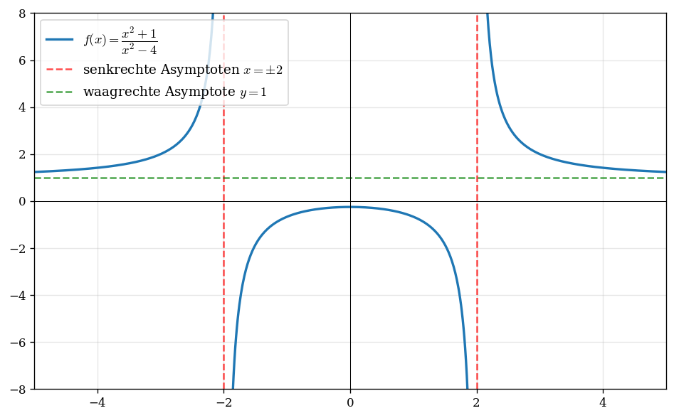

# Rezept: Gebrochen-rationale Funktionen

> Funktionen der Form $f(x) = \dfrac{Z(x)}{N(x)}$ mit Polynomen $Z$, $N$. Typische Fragen: Wo ist $f$ nicht definiert? Wie verhält sich $f$ an Polstellen und für $x \to \pm\infty$?

## Typische Aufgabenstellung
> „Bestimmen Sie den Definitionsbereich, die Asymptoten und skizzieren Sie den Graphen."

## Schritt-für-Schritt

1. **Definitionsbereich**: Nenner $\neq 0$ → $D = \mathbb{R} \setminus \{\text{Nennernullstellen}\}$
2. **Kürzen prüfen**: Zähler und Nenner faktorisieren
   - Gemeinsamer Faktor → hebbare Definitionslücke (Loch, keine Polstelle)
   - Kein gemeinsamer Faktor → Polstelle (senkrechte Asymptote)
3. **Senkrechte Asymptoten**: $x = x_0$ für jede Polstelle
   - Vorzeichen prüfen: $f \to +\infty$ oder $f \to -\infty$ von links/rechts?
4. **Waagrechte/schräge Asymptote** (Verhalten für $x \to \pm\infty$):
   - Zählergrad $<$ Nennergrad → $y = 0$
   - Zählergrad $=$ Nennergrad → $y = \dfrac{\text{führender Koeffizient Zähler}}{\text{führender Koeffizient Nenner}}$
   - Zählergrad $=$ Nennergrad $+\,1$ → Polynomdivision → schräge Asymptote $y = mx + b$
5. **Kurvendiskussion** wie gewohnt (Nullstellen, Extrema, Wendepunkte)
6. **Graph skizzieren**: Asymptoten einzeichnen, dann Graph

## Polynomdivision (Kurzanleitung)
- Wie schriftliche Division: höchste Potenz des Zählers durch höchste Potenz des Nenners
- Ergebnis $\cdot$ Nenner vom Zähler abziehen
- Wiederholen bis Zählergrad $<$ Nennergrad
- $\dfrac{\text{Rest}}{\text{Nenner}} \to 0$ für $x \to \pm\infty$

## Häufige Fehler
- Hebbare Lücke als Polstelle behandelt (erst kürzen!)
- Polynomdivision: Vorzeichen beim Abziehen falsch
- Asymptote vergessen einzuzeichnen
- Definitionsbereich vergessen anzugeben
