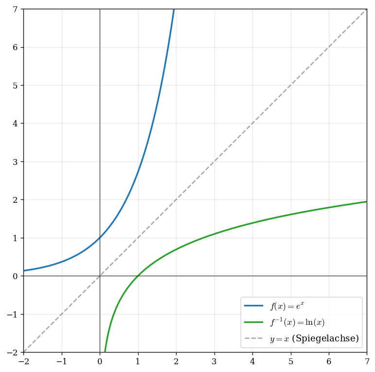

# Rezept: Umkehrfunktion

> Die Umkehrfunktion $f^{-1}$ macht aus $y$ wieder $x$. Ihr Graph entsteht durch Spiegelung des Graphen von $f$ an der Geraden $y = x$. Voraussetzung: $f$ ist streng monoton.

**Voraussetzung:** [Rezept 18: Wertebereich bestimmen](18_wertebereich.md) — $D_{f^{-1}} = W_f$ und $W_{f^{-1}} = D_f$, ohne sicheren Wertebereich geht Schritt 4+5 unten schief.

## Typische Aufgabenstellung
> „Bestimmen Sie die Umkehrfunktion $f^{-1}$."
> „Begründen Sie, dass $f$ umkehrbar ist."
> „Skizzieren Sie den Graphen von $f^{-1}$."

## Schritt-für-Schritt: Umkehrbarkeit begründen

1. $f$ muss **streng monoton** sein (auf dem angegebenen Intervall)
2. Nachweis: $f'(x) > 0$ für alle $x \in D$ (streng monoton steigend)
   ODER $f'(x) < 0$ für alle $x \in D$ (streng monoton fallend)
3. Ggf. Definitionsbereich **einschränken**, damit $f$ monoton ist

## Schritt-für-Schritt: Umkehrfunktion berechnen

1. $y = f(x)$ aufschreiben
2. Nach $x$ auflösen → $x = \dots$ (Ausdruck mit $y$)
3. $x$ und $y$ tauschen → $f^{-1}(x) = \dots$
4. **Definitionsbereich** von $f^{-1}$ $=$ Wertebereich von $f$
5. **Wertebereich** von $f^{-1}$ $=$ Definitionsbereich von $f$

## Graph
- Graph von $f^{-1}$ $=$ Spiegelung des Graphen von $f$ an der Geraden $y = x$

## Wichtige Umkehrfunktionen

| $f(x)$ | $f^{-1}(x)$ |
|---|---|
| $e^x$ | $\ln(x)$ |
| $\ln(x)$ | $e^x$ |
| $x^2$ ($x \geq 0$) | $\sqrt{x}$ |
| $x^3$ | $\sqrt[3]{x}$ |

## Häufige Fehler
- Umkehrbarkeit behauptet, ohne Monotonie nachzuweisen
- Definitionsbereich von $f^{-1}$ vergessen ($=$ Wertebereich von $f$!)
- $x^2$ ist NICHT umkehrbar auf ganz $\mathbb{R}$ → Einschränkung nötig
- Beim Auflösen: $\pm\sqrt{\,}$ vergessen und dann falsche Lösung gewählt
