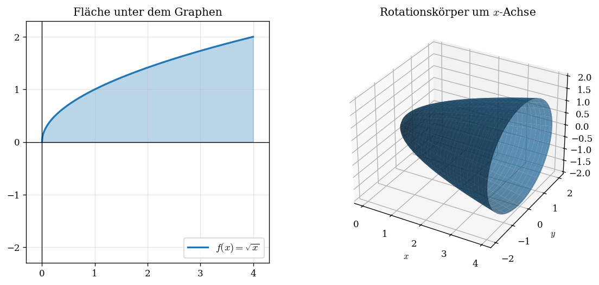

# Rezept: Rotationsvolumen

> Dreht man den Graphen von $f$ um die $x$- oder $y$-Achse, entsteht ein dreidimensionaler Rotationskörper. Sein Volumen ergibt sich als Integral — anschaulich als Summe dünner Kreisscheiben.

## Typische Aufgabenstellung
> „Berechnen Sie das Volumen des Rotationskörpers, der durch Rotation des Graphen von $f$ um die $x$-Achse entsteht."
> „Der Graph von $f$ wird im Intervall $[a;\,b]$ um die $y$-Achse rotiert. Bestimmen Sie das Volumen."

## Rotation um die x-Achse

$$V = \pi \cdot \int_a^b [f(x)]^2 \, dx$$

### Schritt-für-Schritt

1. **Grenzen** $a$ und $b$ ablesen (aus Aufgabe oder Nullstellen)
2. **Funktionsterm quadrieren**: $[f(x)]^2$ ausrechnen und vereinfachen
3. **Integrieren**: Stammfunktion von $[f(x)]^2$ bestimmen
4. **Einsetzen**: Grenzen einsetzen, Differenz bilden
5. **$\pi$ multiplizieren** — erst ganz am Ende!

### Beispiel
$f(x) = \sqrt{x}$ auf $[0;\,4]$:

$$V = \pi \cdot \int_0^4 (\sqrt{x})^2\,dx = \pi \cdot \int_0^4 x\,dx = \pi \cdot \left[\tfrac{x^2}{2}\right]_0^4 = \pi \cdot (8 - 0) = 8\pi$$

## Rotation um die y-Achse

Hier muss die Funktion nach $x$ aufgelöst werden (= Umkehrfunktion).

$$V = \pi \cdot \int_c^d [f^{-1}(y)]^2 \, dy$$

### Schritt-für-Schritt

1. **Umkehrfunktion** bestimmen: $f(x) = y \;\Rightarrow\; x = f^{-1}(y)$
2. **Grenzen umrechnen**: $c = f(a)$, $d = f(b)$ ($y$-Werte!)
3. **$[f^{-1}(y)]^2$ integrieren** nach $dy$
4. **$\pi$ multiplizieren**

### Beispiel (Musterabitur 2026, Aufgabe A6)
$f(x) = x^2$ auf $[0;\,2]$ → Umkehrfunktion: $f^{-1}(y) = \sqrt{y}$

Grenzen: $c = f(0) = 0$, $d = f(2) = 4$

$$V = \pi \cdot \int_0^4 (\sqrt{y})^2\,dy = \pi \cdot \int_0^4 y\,dy = \pi \cdot \left[\tfrac{y^2}{2}\right]_0^4 = 8\pi$$

## Hohlkörper (Rotation zwischen zwei Kurven)

Wenn der Bereich zwischen $f$ und $g$ (mit $f(x) \geq g(x) \geq 0$) rotiert wird:

$$V = \pi \cdot \int_a^b \left([f(x)]^2 - [g(x)]^2\right) dx$$

**Achtung:** Nicht $(f - g)^2$ verwenden! Die Quadrate werden einzeln gebildet.

## Häufige Fehler

- **$\pi$ vergessen** — das $\pi$ steht VOR dem Integral, nicht im Ergebnis nachträglich dranschreiben
- **Quadrat vergessen**: $V = \pi \int f(x)\,dx$ ist FALSCH, es muss $[f(x)]^2$ sein
- **Falsche Achse**: Bei Rotation um die $y$-Achse braucht man die Umkehrfunktion und $y$-Grenzen
- **$(f - g)^2$ statt $f^2 - g^2$**: Beim Hohlkörper werden die Quadrate EINZELN gebildet
- **Negative Funktionswerte**: Kein Problem! Durch das Quadrieren wird alles positiv
- **Einheiten im Sachkontext**: Wenn $f$ in cm und $x$ in cm, dann ist $V$ in $\mathrm{cm}^3$
