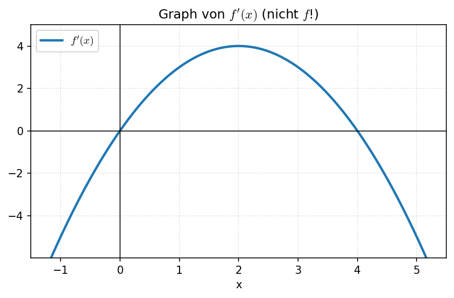

# Diagnosetest — Analysis Grundlagen
**Dauer:** ca. 15–20 Minuten | **Hilfsmittel:** keine (Taschenrechner nicht erlaubt)

> Ziel: Einschätzung, wo du stehst. Kein Stress — es geht nicht um Noten, sondern darum, dass wir wissen, worauf wir uns konzentrieren müssen.

---

## Teil A: Ableitungen (6 Aufgaben)

**A1)** Bestimme die Ableitung $f'(x)$.

a) $f(x) = 3x^4 - 2x^2 + 5x - 1$

b) $f(x) = \sqrt{x}$

c) $f(x) = \dfrac{1}{x^2}$

---

**A2)** Leite ab (Kettenregel).

a) $f(x) = (2x + 3)^5$

b) $f(x) = e^{-2x}$

c) $f(x) = \sin(2x)$

---

**A3)** Leite ab (Produkt- und Quotientenregel).

a) $f(x) = x^2 \cdot e^x$

b) $f(x) = \dfrac{x}{x^2 + 1}$

---

**A4)** Leite ab.

$f(x) = \ln(3x)$

---

**A5)** Bestimme $f'(x)$ und $f''(x)$.

$f(x) = x^3 - 6x^2 + 9x + 1$

---

**A6)** Was beschreibt die Ableitung $f'(x_0)$ geometrisch?

---

## Teil B: Kurvendiskussion (3 Aufgaben)

**B1)** Gegeben ist $f(x) = x^3 - 3x$.

a) Bestimme die Nullstellen.

b) Bestimme die Extrempunkte und deren Art.

c) Bestimme den Wendepunkt.

---

**B2)** Skizziere grob den Graphen einer Funktion $f$, für die gilt:
- $f'(2) = 0$
- $f''(2) < 0$
- $f(2) = 5$

Was für einen Punkt hat $f$ an der Stelle $x = 2$?

---

**B3)** Der folgende Graph zeigt $f'(x)$ (nicht $f$!).

a) In welchem Bereich ist $f$ monoton steigend?

b) Wo hat $f$ ein lokales Maximum?

c) Wo hat $f$ einen Wendepunkt?

---

## Teil C: Integralrechnung (2 Aufgaben)

**C1)** Bestimme eine Stammfunktion $F(x)$.

a) $f(x) = 4x^3 - 2x + 1$

b) $f(x) = e^{2x}$

---

**C2)** Berechne das bestimmte Integral.

$$\int_0^2 (x^2 + 1)\, dx$$

---

## Auswertungsraster (für den Nachhilfelehrer)

| Bereich | Aufgaben | Ergebnis | Einschätzung |
|---------|----------|----------|--------------|
| Grundableitungen | A1 | ☐ sicher  ☐ unsicher  ☐ nicht gekonnt | |
| Kettenregel | A2a, A2b | ☐ sicher  ☐ unsicher  ☐ nicht gekonnt | |
| sin/cos-Ableitung | A2c | ☐ sicher  ☐ unsicher  ☐ nicht gekonnt | |
| Produktregel | A3a | ☐ sicher  ☐ unsicher  ☐ nicht gekonnt | |
| Quotientenregel | A3b | ☐ sicher  ☐ unsicher  ☐ nicht gekonnt | |
| ln-Ableitung | A4 | ☐ sicher  ☐ unsicher  ☐ nicht gekonnt | |
| Höhere Ableitungen | A5 | ☐ sicher  ☐ unsicher  ☐ nicht gekonnt | |
| Geometrische Bedeutung | A6 | ☐ sicher  ☐ unsicher  ☐ nicht gekonnt | |
| Nullstellen | B1a | ☐ sicher  ☐ unsicher  ☐ nicht gekonnt | |
| Extrema | B1b, B2 | ☐ sicher  ☐ unsicher  ☐ nicht gekonnt | |
| Wendepunkte | B1c | ☐ sicher  ☐ unsicher  ☐ nicht gekonnt | |
| Graph von $f'$ lesen | B3 | ☐ sicher  ☐ unsicher  ☐ nicht gekonnt | |
| Stammfunktionen | C1 | ☐ sicher  ☐ unsicher  ☐ nicht gekonnt | |
| Bestimmtes Integral | C2 | ☐ sicher  ☐ unsicher  ☐ nicht gekonnt | |

**Gesamteindruck / Anpassung Stundenplan:**
_________________________________________________________

_________________________________________________________
