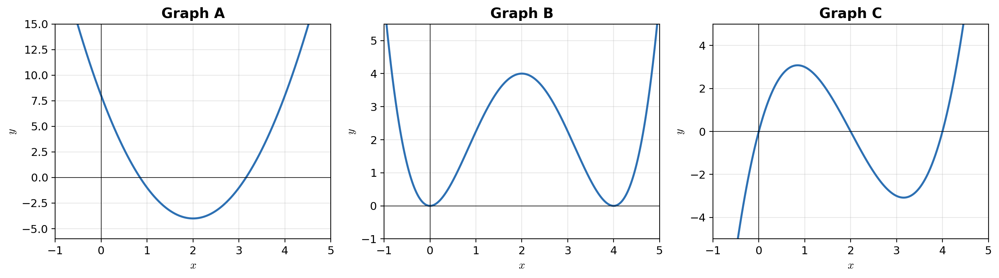

# Übungsklausur — Hilfsmittelfreier Teil (Teil A)
**Dauer:** ca. 40 Minuten | **Hilfsmittel:** keine
> Ziel: Simulation der echten Prüfungssituation

---

## Aufgabe 1: Ableitungen bestimmen (6 Punkte)

Bestimme jeweils die Ableitung $f'(x)$.

a) $f(x) = 5x^3 - 4x^2 + 2x - 7$

b) $f(x) = \dfrac{3}{x} + 2\sqrt{x}$

c) $f(x) = (3x - 1)^4$

d) $f(x) = x^2 \cdot \ln(x)$

e) $f(x) = e^{-x^2}$

f) $f(x) = \sin(2x) + \cos(x)$

---

## Aufgabe 2: Stammfunktionen bestimmen (4 Punkte)

Gib jeweils eine Stammfunktion $F(x)$ an.

a) $f(x) = 6x^2 - 4x + 3$

b) $f(x) = e^{3x}$

c) $f(x) = \dfrac{1}{x}$  ($x > 0$)

d) $f(x) = 4 \cdot \cos(2x)$

---

## Aufgabe 3: Bestimmte Integrale berechnen (4 Punkte)

Berechne ohne Taschenrechner.

a) $\int_0^3 (2x + 1)\,dx$

b) $\int_1^2 x^2\,dx$

c) $\int_0^1 e^x\,dx$

d) $\int_{-1}^1 x^3\,dx$

---

## Aufgabe 4: Graphen zuordnen (3 Punkte)

Gegeben sind drei Graphen A, B und C.

- Graph A zeigt eine nach oben geöffnete Parabel mit Minimum bei $x = 2$.
- Graph B zeigt eine Funktion mit Maximum bei $x = 2$ und Nullstellen bei $x = 0$ und $x = 4$.
- Graph C zeigt eine Funktion mit Nullstellen bei $x = 0$, $x = 2$ und $x = 4$.

Ordne zu: Welcher Graph gehört zu $f$, welcher zu $f'$ und welcher zu $f''$? Begründe kurz.

---

## Aufgabe 5: Zusammenhang f und f' (3 Punkte)

Gegeben ist der Graph von $f'$. Entscheide jeweils, ob die Aussage wahr oder falsch ist. Begründe.

Es gilt: $f'(x) > 0$ für $x < 1$, $f'(1) = 0$, $f'(x) < 0$ für $1 < x < 3$, $f'(3) = 0$, $f'(x) > 0$ für $x > 3$.

a) $f$ hat bei $x = 1$ ein lokales Maximum.

b) $f$ ist im Intervall $[0; 1]$ monoton fallend.

c) $f$ hat bei $x = 3$ ein lokales Minimum.

d) $f$ hat im Intervall $]1; 3[$ mindestens einen Wendepunkt.

---

## Aufgabe 6: Tangentengleichung (3 Punkte)

Bestimme die Gleichung der Tangente an den Graphen von $f(x) = x^3 - 2x + 1$ im Punkt $P(1 \mid f(1))$.

---

## Aufgabe 7: Extrema bestimmen (4 Punkte)

Gegeben ist $f(x) = x^3 - 6x^2 + 9x - 2$.

a) Bestimme alle Extremstellen und deren Art (Hoch-/Tiefpunkt).

b) Berechne die Funktionswerte an den Extremstellen.

---

## Aufgabe 8: Notwendige und hinreichende Bedingung (3 Punkte)

a) Nenne die notwendige Bedingung für eine Extremstelle von $f$.

b) Nenne die hinreichende Bedingung (2. Ableitung).

c) Eine Schülerin sagt: „$f'(2) = 0$, also hat $f$ bei $x = 2$ ein Extremum."
   Erkläre, warum diese Aussage nicht zwingend richtig ist, und gib ein Gegenbeispiel an.

---

## Aufgabe 9: Funktionswerte und Vorzeichen (2 Punkte)

Gegeben ist $f(x) = -x^4 + 4x^2 - 3$.

a) Berechne $f(0)$, $f(1)$ und $f(-1)$.

b) Bestimme das Vorzeichen von $f''(0)$ und interpretiere es.

---

## Aufgabe 10: Integral und Flächeninhalt (3 Punkte)

a) Berechne $\int_0^2 (x^2 - 2x)\,dx$.

b) Skizziere den Graphen von $g(x) = x^2 - 2x$ im Intervall $[0; 2]$.

c) Erkläre, warum das Ergebnis aus a) negativ ist und welcher Zusammenhang zum Flächeninhalt besteht.

---

## Aufgabe 11: Monotonie und Krümmung (2 Punkte)

Gegeben ist $f(x) = e^x \cdot (x - 1)$.

a) Bestimme $f'(x)$ und vereinfache.

b) Für welche $x$-Werte ist $f$ monoton steigend?

---

## Aufgabe 12: Symmetrie und Grenzverhalten (2 Punkte)

Gegeben ist $f(x) = x^4 - 2x^2$.

a) Zeige, dass $f$ achsensymmetrisch zur $y$-Achse ist.

b) Bestimme das Verhalten von $f(x)$ für $x \to \pm\infty$.

---

## Auswertungsraster (für den Nachhilfelehrer)

| Bereich | Aufgaben | Ergebnis | Einschätzung |
|---------|----------|----------|--------------|
| Grundableitungen | 1a, 1b | ☐ sicher  ☐ unsicher  ☐ nicht gekonnt | |
| Kettenregel | 1c, 1e | ☐ sicher  ☐ unsicher  ☐ nicht gekonnt | |
| Produktregel | 1d | ☐ sicher  ☐ unsicher  ☐ nicht gekonnt | |
| Trigon./Kombi | 1f | ☐ sicher  ☐ unsicher  ☐ nicht gekonnt | |
| Stammfunktionen | 2 | ☐ sicher  ☐ unsicher  ☐ nicht gekonnt | |
| Bestimmte Integrale | 3 | ☐ sicher  ☐ unsicher  ☐ nicht gekonnt | |
| Graphen zuordnen | 4 | ☐ sicher  ☐ unsicher  ☐ nicht gekonnt | |
| f ↔ f' Zusammenhang | 5 | ☐ sicher  ☐ unsicher  ☐ nicht gekonnt | |
| Tangentengleichung | 6 | ☐ sicher  ☐ unsicher  ☐ nicht gekonnt | |
| Extrema | 7 | ☐ sicher  ☐ unsicher  ☐ nicht gekonnt | |
| Notw./hinr. Bedingung | 8 | ☐ sicher  ☐ unsicher  ☐ nicht gekonnt | |
| Vorzeichen/Krümmung | 9 | ☐ sicher  ☐ unsicher  ☐ nicht gekonnt | |
| Integral ↔ Fläche | 10 | ☐ sicher  ☐ unsicher  ☐ nicht gekonnt | |
| Monotonie | 11 | ☐ sicher  ☐ unsicher  ☐ nicht gekonnt | |
| Symmetrie/Grenzverh. | 12 | ☐ sicher  ☐ unsicher  ☐ nicht gekonnt | |

**Gesamteindruck / Schwerpunkte für letzte Sitzung:**

_________________________________________________________

_________________________________________________________
